# General overview

## TDA overview
Topological Data Analysis (TDA) is an approach to the analysis of datasets using well established techniques from topology. In what follows we try to give intuitive but far from rigorous explanations of concepts we use, the interested reader can refer to other material like this [TDA survey for data scientists](https://www.frontiersin.org/articles/10.3389/frai.2021.667963/full) for precise definitions and for a comprehensive overview of the topic. An excellent resource to get hand on the topic by doing actual computations is [GUDHI](https://github.com/GUDHI/TDA-tutorial) documentation, including tutorials.
One of main tools of TDA is Persistence Homology (PH), which allows to encode multi-scale topological features of datasets.  
The topological features we will consider are called homology groups and are topological invariants, namely they are not changed by continuous deformation of the topological space under consideration.  
To give some intuition: if you have a piece of clay and you deform it without cutting or gluing pieces together what you will get is topologically equivalent to initial object and hence have same homology.

*Example: a cup and a doughnut are topologically equivalent*  
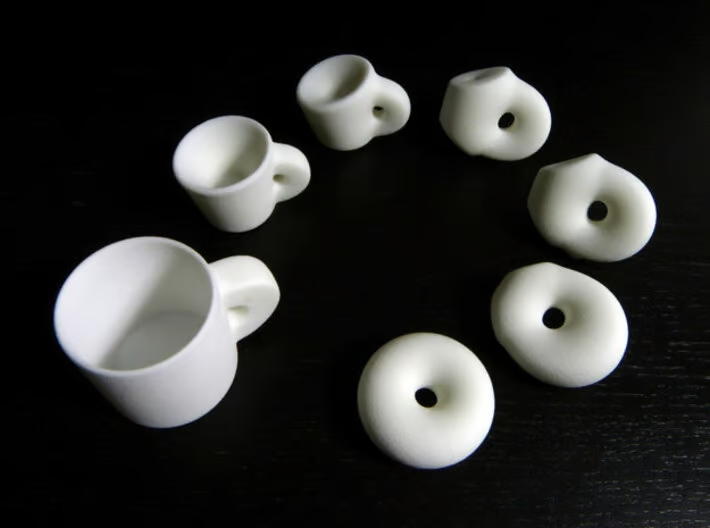  
*Image source: picture by [Henry Segerman](https://math.okstate.edu/people/segerman)*  

  
Informally speaking, homology counts the number of i-dimensional “holes” of the topological space.  
We can define one homology group for each space dimension, in particular in what follows we will be interested in dimensions 0, 1 and 2, where homology groups count:  
- i=0, number of connected components,    
- i=1, number of daily life "holes",  
- i=2, number of cavities. 

As toy example, a football (like a rugby ball, since these two are topologically equivalent) has:  
- one dimensional 0th homology group (since it is connected)  
- zero dimensional 1st homology group (if it had a hole you could not play!)  
- one dimensional 2nd homology group (since the football is empty inside)
 
*Example: on first column are displayed examples of 1-dim and 2-dim hole, while the objects in second and third columns can be continuously deformed to a point, hence their 1-dim and 2-dim homologies are trivial*  
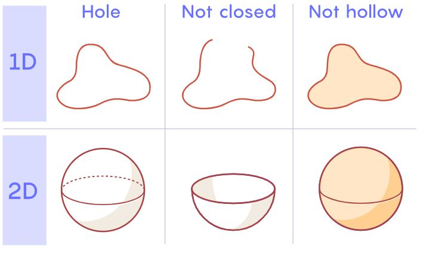   
*Image source: [Quantamagazine](https://www.quantamagazine.org/how-mathematicians-use-homology-to-make-sense-of-topology-20210511/)*

Homology is useful to describe topological spaces, but a cloud of points is not very interesting from a topological point of view: it is just a bunch of topologically trivial connected components with no 1 and 2 dimensional holes!  
The idea behind Persistent Homology is building a family of non-trivial topological spaces originated from the point cloud and then computing the homology of these spaces. In this way PH allows the encode the evolving shape of a cloud of points.  
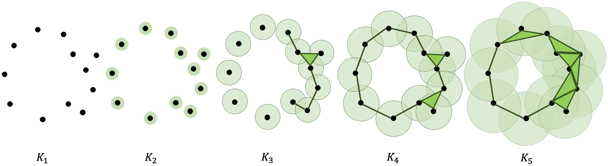  

## PH for protein encoding
In this work we use PH to get insights on topological shape of macromolecules, in particular of protein assemblies.  
We describe molecules by 3d-coordinates of their atoms and define a family of topological spaces using euclidean distance as filtration. In simpler words we take atoms as points in 3d space, we create balls of zero radius centred in each atom and then inflate the balls by increasing their radius. In this way we are creating an increasing family of topological spaces and PH allows us to see how the topology of these spaces evolves. By doing this, PH is able to encode information not only on number of holes but also on their size.

*Example: 3d representation of Epstein Barr virus gr42 protein. Edges (bonds) are useful for visualisations but we will not use them for TDA encoding.*
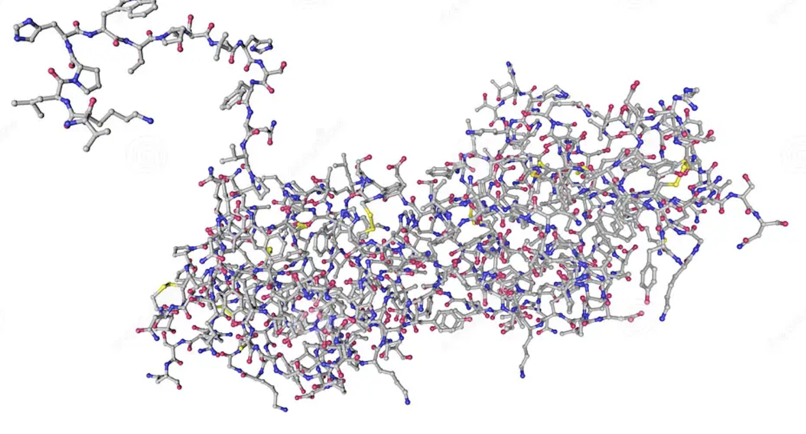  
*[Image source](https://de.dreamstime.com/molekulares-modell-des-epsteinbarr-virus-gr-proteins-atome-sind-als-farbkodierte-kugeln-dargestellt-kohlenstoffgrauer-sauerstoff-image225928227)*

### Protein encoding pipeline
1) Query [PDB entries](https://www.rcsb.org/) of protein assemblies (those having a quaternary structure, namely those comprising two or more protein chains) to get their PDB IDS  
2) Download PDB files of protein assemblies  
3) Extract atoms 3d-coordinates from PDB files  
4) Compute PH of atoms clouds using alpha complexes and represent it as barcodes and persistence landscapes (see  [overview](https://www.frontiersin.org/articles/10.3389/frai.2021.667963/full) or [GUDHI tutorial](https://github.com/GUDHI/TDA-tutorial) for terminology)  
5) Approximate landscape curves using Fourier series  
6) Encode PH of each assembly by leveraging Fourier approximations of landscapes  

### Considerations around data and encoding
TDA can be applied to a huge variety of datasets, all it needs is a cloud of points and a filtration defining a family of increasing topological spaces, anyway not all data are equally suitable for TDA application.
#### Topological shape of data  
First questions to ask before applying TDA is whether we expect the data to have an interesting topological shape and if so, what can we do with it.  
In our case, data are 3d-objects and by using Euclidean distance as filtration we retain an intuitive geometric interpretation of protein topological shape.  
Topology of proteins with quaternary structure can be quite interesting (e.g forming rings, cages, etc, see [1](https://pubs.rsc.org/en/content/articlelanding/2016/cs/c5cs00157a) and [2](https://nanoconvergencejournal.springeropen.com/articles/10.1186/s40580-021-00294-3)) and that's the main reason for focusing first on protein assemblies rather than on proteins formed by a single unit.  

*Example: haemoglobin quaternary structure is made by four subunits*
   
*Image source: [wikipedia](https://en.wikipedia.org/wiki/Hemoglobin)*

*Rmk*: [single unit proteins can be knotted](https://www.technologyreview.com/2016/10/26/156418/the-mystery-of-knotted-proteins/), but this is not detected by PH, since all knots in 3d Euclidean space are homotopy equivalent to the unknot (circle).  

*Example: knotted single unit protein*
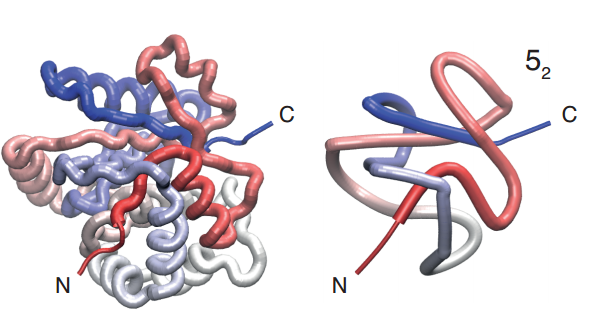  
*Image source: [MIT Technology Review](https://www.technologyreview.com/2016/10/26/156418/the-mystery-of-knotted-proteins/)*

#### Homology groups
Direct homology computation of the topological spaces we are interested in is usually unfeasible, nevertheless Nerve theorem tells us that the original topological space is homotopy equivalent (and hence share same homology) to spaces whose homology is easier to compute. 
Rips-Vietoris complexes are often used to transition from original to simpler space, as they enable fast computation of homology groups that approximates the ones of the original space.  
This is not optimal as sacrifices some interpretability, what we will do instead is relying on alpha complexes, for which Nerve theorem applies, without the need of approximations.  

*Example: comparison of different tools used to compute PH*
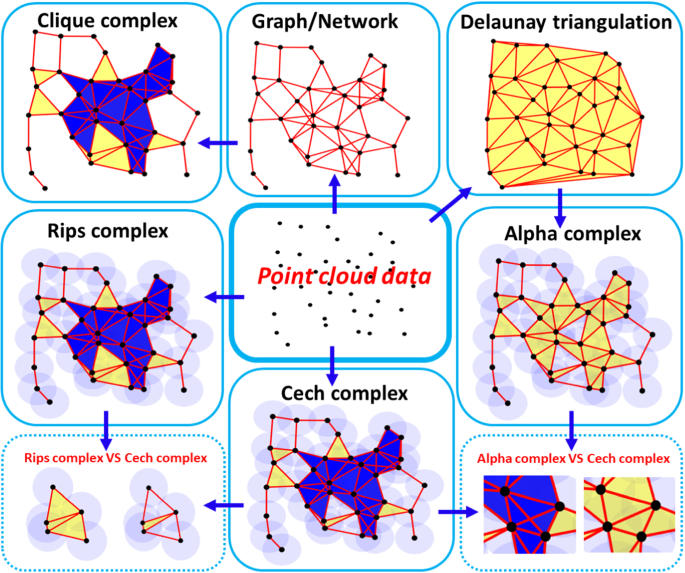  
*Image source: ['Persistent-Homology-based Machine Learning and its
Applications – A Survey'](https://arxiv.org/pdf/1811.00252.pdf)*

We notice that encoding proteins via their atoms 3d-coordinates allows us to encode as much topological information as possible, without bothering to compute homology in higher dimensions, which in general is much more computationally expensive; indeed in this setting homology is non-trivial only in dimensions 0, 1 and 2.

#### PH featurization
PH can be encoded in various equivalent ways: common choices are barcodes, persistence diagrams and persistence landscapes, see [TDA survey for data scientists](https://www.frontiersin.org/articles/10.3389/frai.2021.667963/full) for details.  

*Example: PH representation as barcode and persistence diagram*
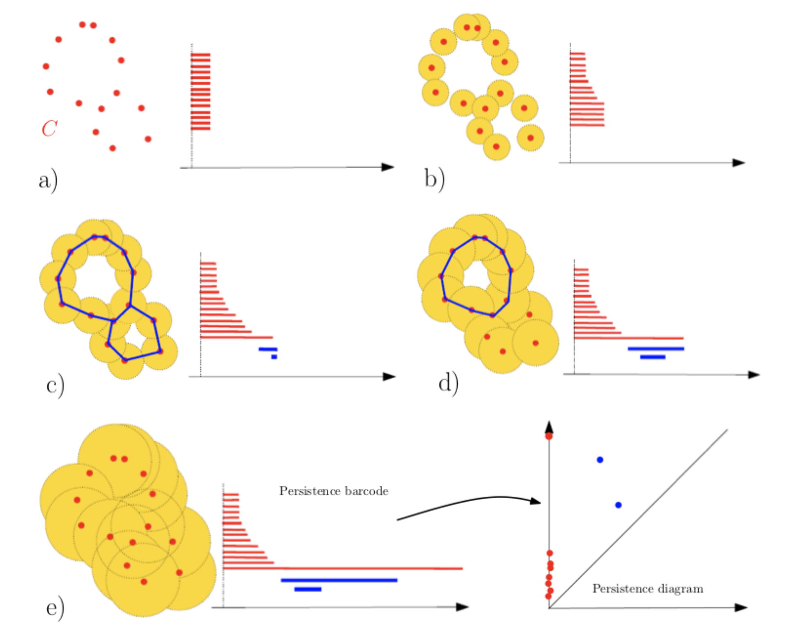  
*Image source: ['An Introduction to Topological Data Analysis: Fundamental and Practical Aspects for Data Scientists'](https://www.frontiersin.org/articles/10.3389/frai.2021.667963/full)*

Efficiently encoding PH information for ML tasks is an active research topic; in this work we use barcode representation to vectorise 0-dimensional PH, while for 1 and 2 dimensional PH we consider landscape representation as periodic curve and then be approximate it as Fourier series.  

<ins>Featurization details</ins>:  
- *dim 0:* take five largest finite end points of the 0-dimensional bars (note there are as many bars as atoms and one of them has infinite length since one connected component lasts forever)  
- *dim 1:* each landscape is approximated by an order 5 Fourier series along with landscape start and end point. we restrict to the first three landscapes.  
- *dim 2:* each landscape is approximated by an order 5 Fourier series along with landscape start and end point. we restrict to the first three landscapes.

Dimension 0 encoding requires 5 variables, while dimensions 1 and 2 require *num_landscapes \* (num coeff Fourier order 5 + num start/end point)  =3 \* (11 + 2) = 39*  each. In total each protein is encoded by 83 = (39 \* 2) + 5 variables.

*Example: first three landscapes in dim 1 for PDB protein 1A1M*
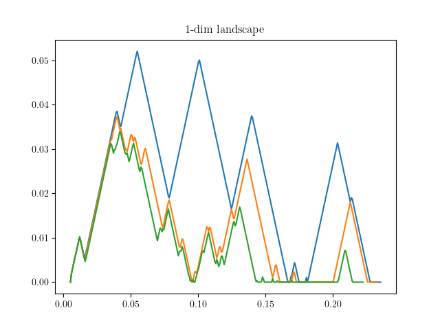 

## Applications
The pipeline described above is quite general and can be used to get insights on the topological shapes of a variety of molecular 3d-structures, or in general of 3d-objects. What comes next is finding useful applications.  
The application discussed here is partitioning protein assemblies according to their topological shapes (recall that PH takes into account number of holes and their size).  
We first define a metric on the space of vectorized proteins (the distance between two landscapes is defined in terms of area of the difference between the two curves), we then compute pairwise distance between proteins and finally we fed the distance matrix to HDBSCAN clustering algorithm which creates cluster of proteins according to their shape.   

This is just one small application but there can be many, if you have any suggestions feel free to reach out! 

[//]: # (TODO : add application details )
[//]: # (TODO: most of biggest assemblies cannot be downloaded...is it because of old pdb format? )

[//]: # ( TODO: add other works on different filtrations and diff homologies...)

[//]: # ( -invariant by isometries like translation, rotation etc - limitations: encodes shape not )

# Code

## Project set up

1) Clone git repo 

2) Create conda environment 
 > conda env create --file=environments.yml  
 
3) Add conda environment kernel to jupyter by activating conda environment and running
 > python -m ipykernel install --user --name tda\_enz\_env --display-name 'tda\_enz\_env'
 
## Encoding pipeline run
The protein encoding pipeline takes PDB-ids from [proteins_assembly.txt](https://github.com/lrigolli/protein_tda/tree/main/data/pdb_ids/proteins_assembly.txt), download corresponding PDB files, extract 3D coordinates from each file and finally encode coordinates using TDA.

Pipeline can be triggered using this [notebook](https://github.com/lrigolli/protein_tda/tree/main/notebooks/protein_encoding.ipynb) or by running 'tda\_encoding\_pipeline' script directly from python shell.

If you are interested in encoding proteins other than assemblies you should find their PDB IDs by querying to PDB database (see [here](https://github.com/lrigolli/protein_tda/blob/main/how_to_get_data.txt) for more details) and store them as txt file [here](https://github.com/lrigolli/protein_tda/tree/main/data/pdb_ids).

### Requirements
Main requirement for encoding pipeline is [GUDHI](https://github.com/GUDHI/TDA-tutorial) library, which is used for all PH computations and visualization.

### Computational time
The most computational intensive part of the process is computing PH, which usually takes few seconds. As example, it takes less than one minute to encode '6GYB' PDB entry which is one of the biggest in considered data (it has about 60k atoms) on a 2.3 GHz, 8GB RAM MacBook Pro laptop from 2017.

## Applications
Featurizing all protein assemblies can take some time, luckily for applications there is no need to do more than once. For convenience you can download the vectorized proteins, as well as their obtained persistence diagrams and landscapes from [here](https://drive.google.com/drive/folders/1Y1qFJvhtq4VUSEV7cY4jjYMyb_AfFEMX) and move them in output directory of your cloned git project.  
In [notebook](https://github.com/lrigolli/protein_tda/tree/main/notebooks/protein_classification.ipynb) we define a distance between protein landscapes and use it to compute pairwise dissimilarity of proteins homologies in dimension 1 and 2. We then apply a clustering algorithm (HDBSCAN) to group together connected proteins (we infer if a protein is connected by looking at 0-dim PH) whose 1-dim and 2-dim homologies are close. In such a way we are able to cluster proteins according to their topological shape.

In example below we show landscapes and 3d-structure of one of detected clusters, consisting of four proteins.  

*First three 1-dim landscapes of 4NGE, 5NJ9, 5NJA, 5NJF*  
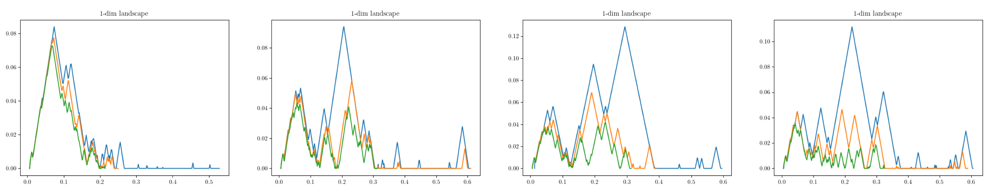  

*First three 2-dim landscapes of 4NGE, 5NJ9, 5NJA, 5NJF*   
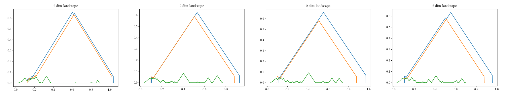  

*3D structure of 4NGE, 5NJ9, 5NJA, 5NJF*   
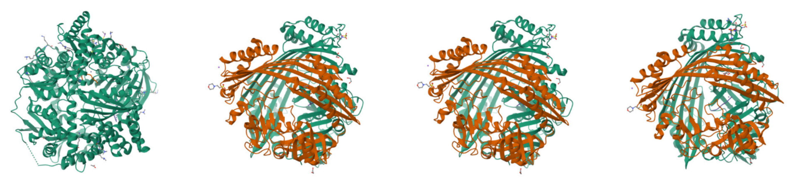   
*Image source: [RCBS website](https://www.rcsb.org/)*  

